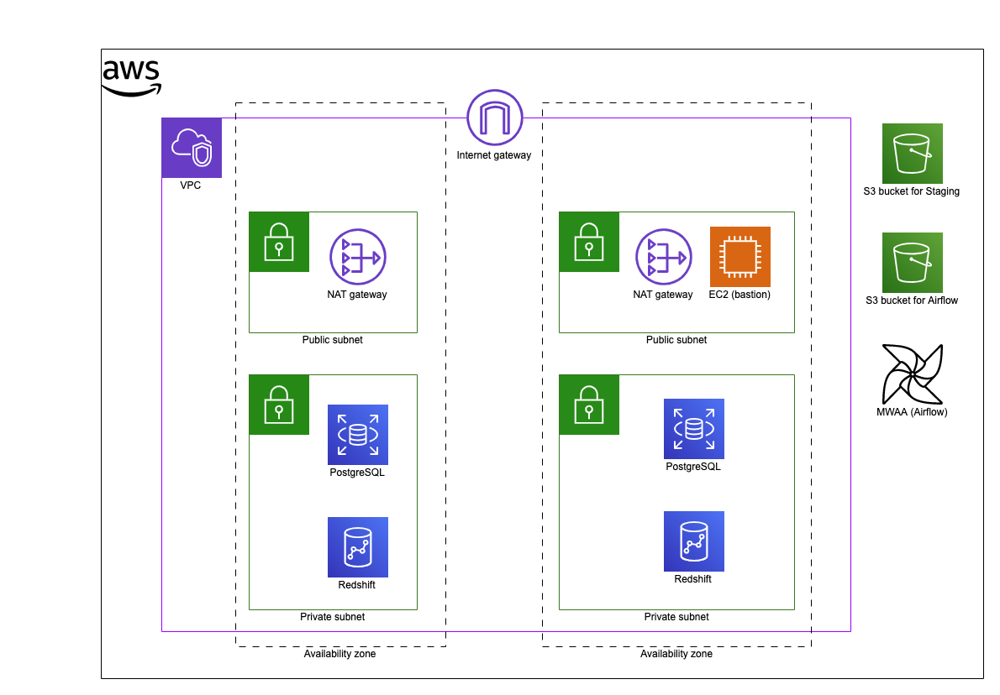
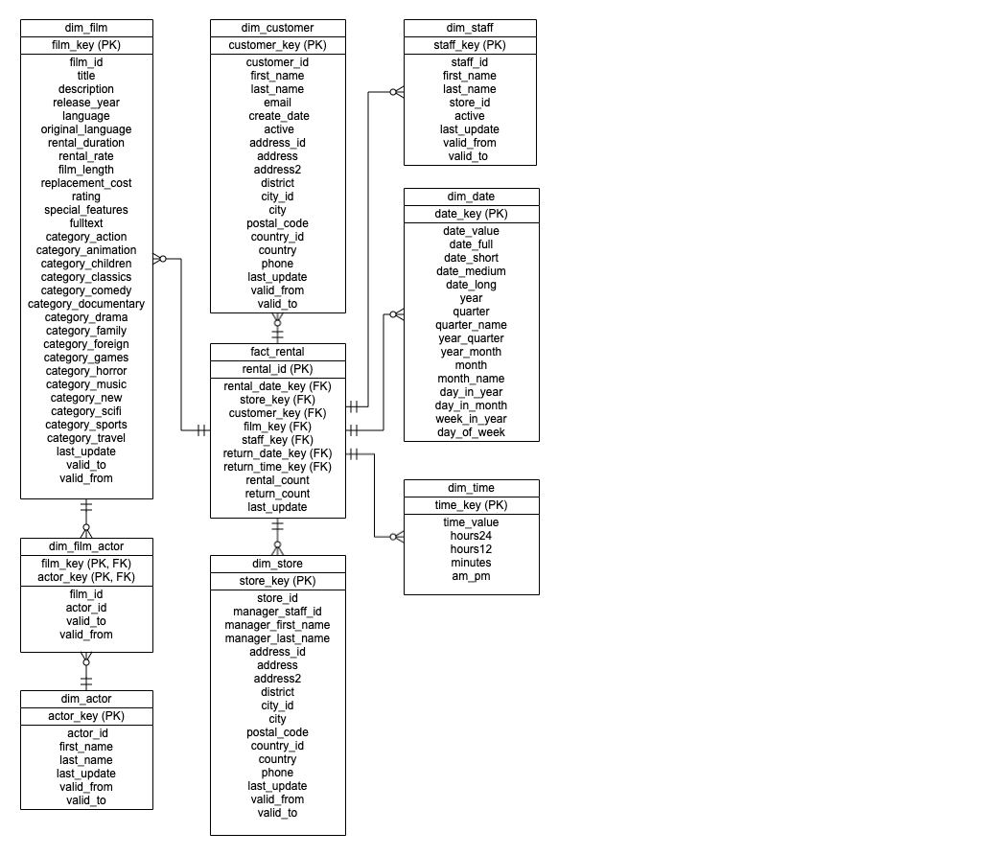
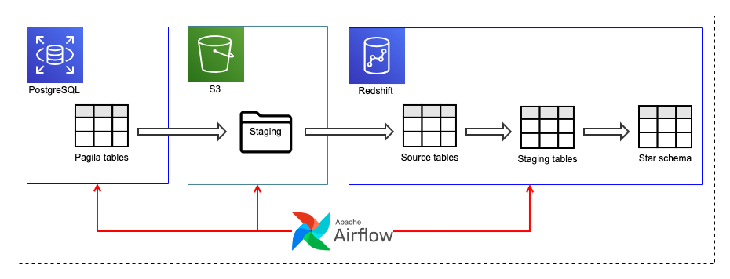
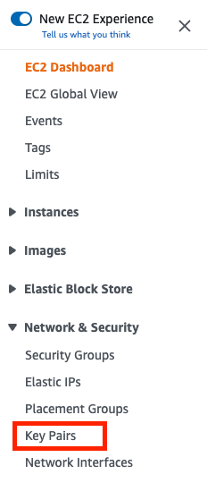
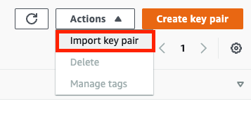
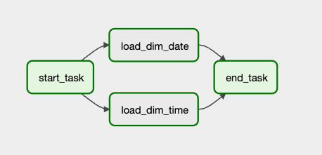
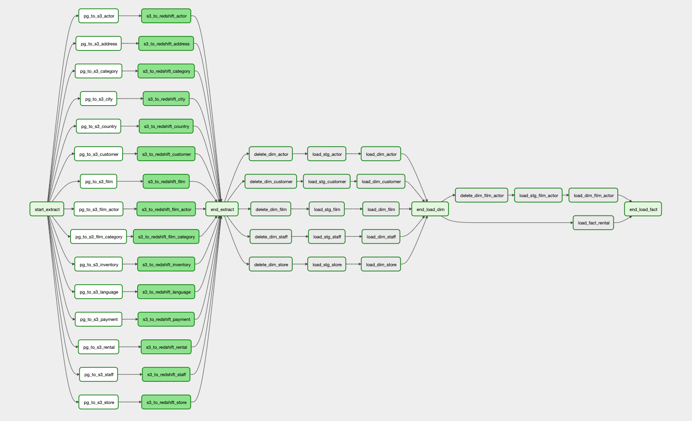

# Pagila ETL project with Redshift and Airflow

## Overview

This project builds an ETL pipeline to load the [Pagila](https://github.com/devrimgunduz/pagila) dataset from PostgreSQL into a star schema with Type 2 SCD (slowly changing dimensions) in Amazon Redshift. The entire pipeline is built on [AWS](https://aws.amazon.com/). 

### Tools used

- AWS
  - [Amazon RDS for PostgreSQL](https://aws.amazon.com/rds/postgresql/)
  - [Amazon Redshift](https://aws.amazon.com/redshift/)
  - [Amazon Managed Workflows for Apache Airflow (MWAA)](https://aws.amazon.com/managed-workflows-for-apache-airflow/)
- [Terraform](https://www.terraform.io/)

# Solution design

## System design


The high-level overview of the ETL system is shown below.



The system consists of the following components:

- A Amazon RDS PostgreSQL database (the source database)
- A RedShift database (the data warehouse)
- An S3 bucket (staging area)
- An EC2 instance (bastion host)

The PostgreSQL database resides in two private subnets in two different Availability Zones in a VPC (see more details in the [User Guide](https://docs.aws.amazon.com/AmazonRDS/latest/UserGuide/USER_VPC.WorkingWithRDSInstanceinaVPC.html)). For simplicity, the Redshift database is also created in the same subnets in this project. However, it is most likely in separate subnets or even in a different VPC in reality. 

An MWAA (Amazon Managed Workflows for Apache Airflow) instance is set up to access the private subnets so that it can manage the ETL workflow. An S3 bucket is created for the Airflow components ([User Guide](https://docs.aws.amazon.com/mwaa/latest/userguide/mwaa-s3-bucket.html)). In addition, another S3 bucket is used for the staging area.

The private subnets are connected to NAT gateway in public subnets, which are connected to an Internet gateway to access the Internet. 

An EC2 instance is created in a public subnet to perform administration purposes.

## Data warehouse design

### Pagila 

The source tables are based on [Pagila](https://github.com/devrimgunduz/pagila), which is *a port of the Sakila example database available for MySQL, which was originally developed by Mike Hillyer of the MySQL AB documentation team.* In this project, all data is loaded as part of the initial setup.

The schema comprises 15 tables, as shown in the ER diagram below.


### Star schema

The target database in the data warehouse (Redshift) is based on the Pagila [star schema example](https://learning.oreilly.com/library/view/pentaho-r-kettle-solutions/9780470635179/ch04.html#sakila) by Matt Casters, Roland Bouman and Jos van Dongen. The ER diagram is shown below.



There are two transaction tables in the source Pagila schema, rental and payment, but the only rental dataset is included as a fact table in the star schema in this project. All the dimension tables are treated as Type 2 [SDCs (slowly changing dimensions)](https://en.wikipedia.org/wiki/Slowly_changing_dimension), although no mechanism is implemented to update the source tables in this project.

### ETL data flow



The ETL tasks perform the tasks in the following order:

  - Extract the data from each table in PostgreSQL as CSV files, and upload them into the S3 bucket (staging area) 

      The ETL job (DAG in Airflow) is scheduled daily. 
      
      For the transaction tables (rental and payment), the tasks extract the records for the logical date based on the *last_update* column in each source table.

      The full dataset (the entire table) is extracted for the dimension tables.

  - Load the CSV files from the S3 bucket into the source tables in Redshift

      The structure of the source tables is the same as the source tables in PostgreSQL, i.e. this task loads the CSV files into tables in Redshift without any transformation.

  - For the dimension tables, copy the source table data into the staging table while performing the required transformation and Type 2 SCD (slowly changing dimension) calculations in Redshift

      This task generates surrogate keys for each dimension table, performs transformations (joins), and makes SCD changes. 

      The md5 function generates the surrogate keys, which are also used to detect the source and target record changes. 
      
      For SCD, the source tables contain the entire records. Therefore, the following operations are conducted:

      - If the source records do not exist in the target table, they are flagged as "inserted".
      - If the target records do not exist in the source table, they are flagged as "deleted".
      - If both source and target tables contain the same records based on natural keys but have different surrogate keys (i.e. hash values), they are flagged as "updated".

  - Load/update the target SCD tables in the star schema in Redshift

      - The "inserted" records need to be "opened". The source records are inserted into the target table with the effective TO date to the theoretical maximum value ('9999-12-31').
      - The "deleted" records need to be "closed". The effective TO date of the corresponding target records is set to (logical date - 1 day).
      - The existing "updated" records need to be "closed", and the new records need to be "opened" by performing the both "deleted" and "inserted" operations above.

  - The records are directly loaded into the target table for the fact table (`fact_rental`), as the records are always appended. The natural keys are replaced with the surrogate keys during the insert by looking up the dimension tables.

  - The `dim_date` and `dim_time` tables contain static records. Therefore, a separate ETL job (DAG) is created to populate these tables. The DAG is not scheduled and is designed to run as part of the initial setup.


# Deployment

## Provisioning AWS infrastructure by Terraform

If you don't have Terraform on your local machine, you can install it by following the [instuctions](https://learn.hashicorp.com/tutorials/terraform/install-cli).

Create a file `vars.tfvars` in the `terraform` directory with the appropriate values for the variables. An example is shown below.

```
project_name           = "pagila"
env                    = "dev"
account_id             = "(Your AWS account ID)"
region                 = "eu-west-1"
region_az1             = "eu-west-1a"
region_az2             = "eu-west-1b"
postgres_dbname        = "pagila"
postgres_username      = "postgres"
postgres_password      = "postgres"
redshift_dbname        = "pagila_dw"
redshift_username      = "redshift"
redshift_password      = "RedShift123!"
s3_staging_bucket_name = "pagila-staging"
s3_airflow_bucket_name = "pagila-airflow"
ec2_key_name           = "id_ed25519"
```

The `ec2_key_name` is an EC2 key pair name in AWS. If you don't have a key pair, you can create one. The following is an example of macOS.

1. Create an SSH key. 

```
$ ssh-keygen -t ed25519
```

2. Go to the AWS Console -> EC2. Select "Key Pairs" from the left sidebar. 



3. Select "Import key pair" from the Actions drop-down menu in the top-right corner.



4. Fill in the key pair name, select the public key file generated in step 1 above as "Key pair file", and press the "Import key pair" button. 

5. Specify the key pair name as  `ec2_key_name` in the `vars.tfvars` file.

Then, run the terraform commands.

```
$ cd terraform
$ terraform init
$ terraform plan -var-file=vars.tfvars
$ terraform apply -var-file=vars.tfvars
```

## Setting up PostgreSQL database

The PostgreSQL database should have been created in Amazon RDS in the "Provisioning AWS infrastructure by Terraform" step. You can connect to the database through the bastion host using an SSH tunnel.

In a terminal window, create an SSH tunnel.

```
$ ssh -L 5432:RDS_ENDPOINT:5432 ubuntu@EC2_PUBLIC_IP_ADDRESS
```

`RDS_ENDPOINT`: The Endpoint (URL) of the PostgreSQL database in AWS, which can be found in the Terraform output (db_instance_endpoint) or on the AWS console (RDS).

`EC2_PUBLIC_IP_ADDRESS`: The public IP address of the EC2 (bastion) instance, which can be found in the Terraform output (ec2_bastion_host) or on the AWS console (EC2).

Then, create the Pagila tables using the PostgreSQL client CLI on a separate terminal window.

```
$ cd postgresql
$ psql -h localhost -U POSTGRESQL_USER_NAME -d POSTGRESQL_DATABASE_NAME -f pagila_init.sq
```

`POSTGRESQL_USER_NAME: The user name specified as `postgres_username` in the `vars.tfvars` file.

`POSTGRESQL_DATABASE_NAME`: The PostgreSQL database name specified as `postgres_dbname` in the `vars.tfvars` file.

When prompted, type in the PostgreSQL user password (`postgres_password` value in the `vars.tfvars` file)


## Setting up Redshift database

The Redshift database should have been created in Amazon RDS in the "Provisioning AWS infrastructure by Terraform" step. The tables can be created in the same way as the PostgreSQL database.

First, create an SSH tunnel:

```
$ ssh -L 5439:REDSHIFT_CLUSTER_ENDPOINT:5439 ubuntu@EC2_PUBLIC_IP_ADDRESS
```

`REDSHIFT_CLUSTER_ENDPOINT`: The Endpoint (URL) of the Redshift cluster in AWS, which can be found in the Terraform output (redshift_cluster_endpoint) or on the AWS console (Redshift).

`EC2_PUBLIC_IP_ADDRESS`: The public IP address of the EC2 (bastion) instance, which can be found in the Terraform output (ec2_bastion_host) or on the AWS console (EC2).

Then, create the tables using the PostgreSQL client CLI.

```
$ cd redshift
$ psql -h localhost -U REDSHIFT_USER_NAME -d REDSHIFT_DATABASE_NAME -p 5439 -f pagila_dw.sql
```

`REDSHIFT_USER_NAME`: The user name specified as `redshift_username` in the `vars.tfvars` file.

`REDSHIFT_DATABASE_NAME`: The Redshift database name specified as `redshift_dbname` in the `vars.tfvars` file.

When prompted, type in the PostgreSQL user password (`redshift_password` value in the `vars.tfvars` file)

## Setting up Airflow

The Airflow DAG files and plugins need to be copied to the S3 bucket created by Terraform. The details can be found in the [User Guide](https://docs.aws.amazon.com/mwaa/latest/userguide/configuring-dag-folder.html), but the following is a summary of the deployment tasks.

1. Copy the DAG files to the S3 bucket. 

```
$ cd airflow/dags
$ aws s3 cp . s3://AIRFLOW_S3_BUCKET_NAME/dags/ --recursive
```

`AIRFLOW_S3_BUCKET_NAME`: The S3 bucket name (`s3_airflow_bucket_name` in the `vars.tfvars` file) 

The `sql` directory is included in the `dags` directory due to the restrictions in Amazon MWAA.


2. Copy the plugins.zip to the S3 bucket and update the MWAA environment.

```
$ cd plugins
$ aws s3 cp plugins.zip s3://AIRFLOW_S3_BUCKET_NAME/plugins.zip
```

After updating the plugin.zip file, the MWAA needs to be updated. First, find out the version number of the plugin.zip file.

```
$ aws s3api list-object-versions --bucket AIRFLOW_S3_BUCKET_NAME | jq  -c '.Versions[] | select(.Key | contains("plugins.zip")) | select(.IsLatest == true) | .VersionId'
```

Then, update the MWAA environment.

```
$ aws mwaa update-environment --name MWAA_ENVIRONMENT_NAME --plugins-s3-object-version VERSIONID --plugins-s3-path plugins.zip
```

`MWAA_ENVIRONMENT_NAME`: The MWAA environment name (`project_name` in the `vars.tfvars` file)
`VERSIONID`: The version ID of the `plugin.zip` obtained in the previous step.

Alternatively, you can update the MWAA environment from the AWS Console (MWAA).


# Operations

The URL for the Airflow web UI can be found in the Terraform output (`airflow_webserver_url`) or on the AWS Console (MWAA).

First, populate the static dimension tables (`dim_date` and `dim_table`) by manually running the DAG `load_static`.



Then, unpause the DAG `pagila_etl`, which should start automatically.




# Future enhancement plans

The following functionality is yet to be implemented.

- Data visualisation layer 
- CI/CD pipeline integration
- Redshift database configuration